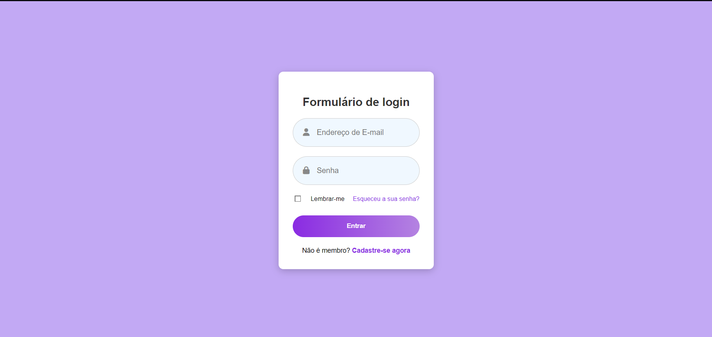

# 🎨 Simple Login Form

[](https://camylla-ops.github.io/Simple-Login-Page)


Um formulário de login moderno e responsivo com design atraente, desenvolvido com HTML5 e CSS3.



## ✨ Funcionalidades
- Design moderno com gradientes
- Ícones integrados do Font Awesome
- Efeito hover no botão de login
- Layout totalmente responsivo
- Opções de "Lembrar-me" e recuperação de senha
- Animações suaves

## 🛠️ Tecnologias
- HTML5 Semântico
- CSS3 (Flexbox, Gradientes, Transições)
- Font Awesome Icons
- Design Responsivo (Mobile First)

## 🚀 Como Executar
```bash
git clone https://github.com/camylla-ops/Simple-Login-Page.git
cd Simple-Login-Page
abra o arquivo index.html no navegador
